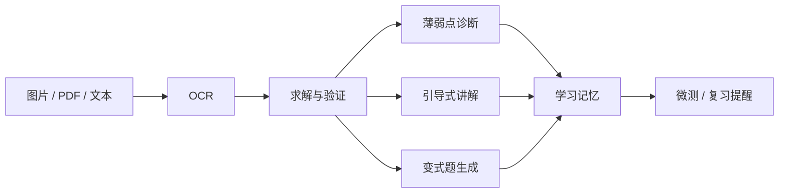

# MathClaw

MathClaw 是一个面向初高中数学学习场景的多模态学习工作台。它支持图片、截图、PDF 和文本输入，围绕一道题或一张试卷，完成 `OCR -> 求解与验证 -> 薄弱点诊断 -> 引导讲解 -> 变式题生成 -> 记忆更新/复习提醒` 这条主链路。

当前仓库是在历史 `ResearchClaw` 基础上演进出来的，所以你仍然会看到一些旧名字：

- Python 包名：`researchclaw`
- CLI 命令：`researchclaw`
- 目录：`src/researchclaw/...`

这些属于遗留命名，不影响把系统作为 `MathClaw` 使用。

## 适用场景

MathClaw 当前重点面向：

- 初中数学
- 高中数学
- 试卷批改
- 错因诊断
- 引导式讲解
- 变式题训练
- 跨会话学习记忆

不建议把当前版本继续当作论文检索/科研助手使用。仓库里仍有少量历史代码，但产品主路径已经转向数学学习。

## 核心能力

- 图片 / PDF / 文本输入
- 题目或试卷 OCR
- 解题与结果验证
- 当前错误的薄弱点诊断
- 引导式讲解
- 变式题生成
- 全局学习记忆
- 企业微信、QQ 通道接入
- Tavily / Playwright / Filesystem MCP 扩展
- 心跳式学习提醒

## 主链路



当前在线上启用的 5 个核心 Skill 是：

- `OCR`
- `Solve`
- `Diagnose`
- `Guide`
- `Variants`

## 触发逻辑

系统当前有两条主要入口：

1. `批改` 路由
- 用户消息里包含“批改”，或者直接上传图片/截图/PDF 后进入解题链路。
- 这条链路默认不走网络搜索。

2. `搜索` 路由
- 用户消息里包含“搜索”时，优先走搜索/MCP 能力。
- 适合搜试卷、视频、教辅、资料。

示例：

- `批改我的试卷`
- `讲解第 3 题`
- `给我三道变式题`
- `搜索 2025 年新高考一卷数学试卷`

## 仓库结构

```text
/root/autodl-tmp/mathclaw
├─ console/                      # React + Vite 前端
├─ scripts/                      # 启动脚本
├─ src/researchclaw/             # 后端主代码
│  ├─ agents/                    # Agent / pipeline / tools / skills
│  ├─ app/                       # FastAPI app / channels / routers / runner / crons
│  ├─ cli/                       # CLI 入口
│  ├─ providers/                 # 模型提供商存储与管理
│  └─ config/                    # 默认配置
├─ tests/                        # 测试
├─ .researchclaw/                # 运行目录（配置、会话、记忆、产物）
├─ .researchclaw.secret/         # 密钥与敏感信息目录
├─ .runtime/                     # PID / 运行日志
├─ logo.png
├─ pyproject.toml
└─ README.md
```

## 环境要求

建议环境：

- Python `3.10` - `3.13`
- Node.js `18+`
- npm `9+`
- Linux 服务器（当前线上主要按 Linux 跑）
- 能访问模型 API
- 如果启用 Playwright MCP，需要 `npx`

## 安装后端依赖

```bash
cd /root/autodl-tmp/mathclaw
python -m pip install -U pip
python -m pip install -e .
```

如果服务器上默认 `python` 不在 PATH，可以直接用你的 Conda/Miniconda Python，例如：

```bash
/root/miniconda3/bin/python -m pip install -U pip
/root/miniconda3/bin/python -m pip install -e .
```

## 安装前端依赖

```bash
cd /root/autodl-tmp/mathclaw/console
npm install
```

## 运行目录

MathClaw 推荐把所有运行文件都放在仓库目录下，而不是 `~/.researchclaw`。

当前仓库采用：

- 工作目录：`/root/autodl-tmp/mathclaw/.researchclaw`
- 密钥目录：`/root/autodl-tmp/mathclaw/.researchclaw.secret`
- 运行日志目录：`/root/autodl-tmp/mathclaw/.runtime`

启动前建议显式设置：

```bash
export RESEARCHCLAW_WORKING_DIR=/root/autodl-tmp/mathclaw/.researchclaw
export RESEARCHCLAW_SECRET_DIR=/root/autodl-tmp/mathclaw/.researchclaw.secret
```

## 模型配置

### 方式一：前端配置（推荐）

启动系统后，直接在前端“模型配置”页面添加提供商并启用。

当前代码支持的提供商配置结构是：

- `name`
- `provider_type`
- `api_key`
- `base_url`
- `model_name`
- `enabled`
- `extra`

### 方式二：通过 API 配置

当前后端提供了模型配置接口：

- `GET /api/providers`
- `POST /api/providers`
- `POST /api/providers/{name}/enable`
- `POST /api/providers/{name}/apply`

示例：配置一个兼容 OpenAI 接口的视觉模型。

```bash
curl -X POST http://127.0.0.1:6006/api/providers \
  -H "Content-Type: application/json" \
  -d '{
    "name": "dashscope-qwen35-plus",
    "provider_type": "openai",
    "api_key": "<YOUR_API_KEY>",
    "base_url": "https://dashscope.aliyuncs.com/compatible-mode/v1",
    "model_name": "qwen3.5-plus-2026-02-15",
    "enabled": true,
    "extra": {
      "supports_vision": true
    }
  }'

curl -X POST http://127.0.0.1:6006/api/providers/dashscope-qwen35-plus/apply
```

说明：
- 当前代码里很多数学链路依赖视觉输入，所以建议选择支持视觉的模型。
- 如果你只做纯文本调试，也可以先配文本模型。

## 通道配置

QQ 和企业微信当前都采用与 `NanoBot` 类似的“凭证直连”思路，但字段名称以 **MathClaw 当前代码** 为准。

配置文件位置：

- `/root/autodl-tmp/mathclaw/.researchclaw/config.json`

### QQ 配置

QQ 通道代码当前读取的字段是：

- `app_id`
- `client_secret`
- `bot_prefix`（可选）

对应代码：
- [QQ channel](/root/autodl-tmp/mathclaw/src/researchclaw/app/channels/qq/channel.py)

示例：

```json
{
  "channels": {
    "qq": {
      "enabled": true,
      "app_id": "<QQ_APP_ID>",
      "client_secret": "<QQ_CLIENT_SECRET>",
      "bot_prefix": ""
    }
  }
}
```

### 企业微信配置

企业微信当前使用长连接机器人模式，读取的字段是：

- `bot_id`
- `secret`
- `bot_prefix`（可选）
- `welcome_message`（可选）

对应代码：
- [WeCom channel](/root/autodl-tmp/mathclaw/src/researchclaw/app/channels/wecom/channel.py)

示例：

```json
{
  "channels": {
    "wecom": {
      "enabled": true,
      "bot_id": "<WECOM_BOT_ID>",
      "secret": "<WECOM_SECRET>",
      "bot_prefix": "",
      "welcome_message": ""
    }
  }
}
```

### 关于通道配置的建议

- 开发期可以先只开一个通道，便于定位问题。
- 正式环境建议分开测试 QQ 和企业微信。
- 如果机器人曾被其它程序占用，先停掉旧连接再启 MathClaw。

## MCP 配置（可选）

当前仓库已经支持 MCP 客户端配置，典型用法是：

- `Tavily`：搜索试卷、视频、教辅、资料
- `Playwright`：动态网页抓取
- `Filesystem`：访问仓库和题库目录

示例结构：

```json
{
  "mcp": {
    "clients": {
      "tavily": {
        "name": "Tavily Search",
        "description": "Remote Tavily MCP for web search and extraction.",
        "enabled": true,
        "transport": "streamable_http",
        "url": "https://mcp.tavily.com/mcp/?tavilyApiKey=<TAVILY_API_KEY>",
        "headers": {},
        "command": "",
        "args": [],
        "env": {},
        "cwd": ""
      },
      "playwright": {
        "name": "Playwright Browser",
        "description": "Browser automation for dynamic exam and education sites.",
        "enabled": true,
        "transport": "stdio",
        "url": "",
        "headers": {},
        "command": "npx",
        "args": [
          "-y",
          "@playwright/mcp@latest",
          "--headless",
          "--no-sandbox"
        ],
        "env": {},
        "cwd": ""
      },
      "filesystem": {
        "name": "Exam Filesystem",
        "description": "Safe file access for exam archives and working directories.",
        "enabled": true,
        "transport": "stdio",
        "url": "",
        "headers": {},
        "command": "npx",
        "args": [
          "-y",
          "@modelcontextprotocol/server-filesystem",
          "/root/autodl-tmp/mathclaw",
          "/root/autodl-tmp/mathclaw/.researchclaw",
          "/root/autodl-tmp/mathclaw/.researchclaw/exam_bank"
        ],
        "env": {},
        "cwd": ""
      }
    }
  }
}
```

## 心跳提醒（可选）

当前代码支持“主动学习提醒”。配置位置：

- `/root/autodl-tmp/mathclaw/.researchclaw/config.json`
- `/root/autodl-tmp/mathclaw/.researchclaw/HEARTBEAT.md`

示例：

```json
{
  "agents": {
    "defaults": {
      "heartbeat": {
        "enabled": true,
        "every": "30m",
        "target": "last"
      }
    }
  }
}
```

说明：
- `target: last` 表示发给最近活跃的会话/通道。
- 如果不需要主动提醒，把 `enabled` 设为 `false`。

## 推荐启动方式

### 方式一：使用仓库内置启动脚本（推荐）

当前仓库已经有专门的后端启动脚本：

```bash
cd /root/autodl-tmp/mathclaw
/root/miniconda3/bin/python scripts/start_researchclaw6006.py
```

这个脚本会自动：
- 杀掉旧的 6006 进程
- 设置 `RESEARCHCLAW_WORKING_DIR`
- 设置 `RESEARCHCLAW_SECRET_DIR`
- 把后端日志写到 `.runtime/researchclaw6006-live.log`

前端开发模式启动：

```bash
cd /root/autodl-tmp/mathclaw/console
npm run dev -- --host 0.0.0.0 --port 6008 --strictPort
```

### 方式二：直接启动 CLI

```bash
cd /root/autodl-tmp/mathclaw
export RESEARCHCLAW_WORKING_DIR=/root/autodl-tmp/mathclaw/.researchclaw
export RESEARCHCLAW_SECRET_DIR=/root/autodl-tmp/mathclaw/.researchclaw.secret
/root/miniconda3/bin/researchclaw app --host 0.0.0.0 --port 6006
```

### 方式三：使用仓库原始 `start.sh`

仓库根目录还有一个历史 `start.sh`，可以使用，但推荐优先用 `scripts/start_researchclaw6006.py`，因为后者已经固定绑定了仓库内运行目录。

## 启动后验证

### 后端健康检查

```bash
curl http://127.0.0.1:6006/api/health
```

预期：

```json
{"status":"ok"}
```

### 前端访问

如果是本机：

- 前端：`http://127.0.0.1:6008`
- 后端 API：`http://127.0.0.1:6006`

如果你使用云端端口映射或反向代理，请把 `6008` 和 `6006` 映射到自己的访问域名。

### 试卷链路验证

你可以直接上传一张试卷图片，然后发送：

```text
批改我的试卷
```

系统会按顺序返回：

1. 批改与薄弱点
2. 引导讲解
3. 变式题

### 搜索链路验证

```text
搜索 2025 年新高考一卷数学试卷
```

系统会优先走搜索/MCP 路由，而不是批改路由。

## 常见问题

### 1. 为什么命令还是 `researchclaw`？

因为仓库历史包名还没整体迁移。当前产品名已经是 `MathClaw`，但后端 CLI 仍沿用旧包名。

### 2. 为什么有些旧代码里还残留 ResearchClaw / papers / arxiv？

仓库最初是科研工作台，后来改造成数学学习产品。当前主链路已经是数学学习，但历史模块还没完全删净。

### 3. 为什么前端偶尔改完后不生效？

这是单页应用常见缓存问题。优先这样处理：

1. `Ctrl+F5` 强刷
2. 关闭旧标签页重新打开
3. 如果还是不对，再清站点缓存

### 4. 为什么企业微信不回消息？

先检查：

- `6006` 是否正常
- 企业微信通道是否启用
- `bot_id` / `secret` 是否正确
- 机器人是否被其它程序占用
- 日志：`/root/autodl-tmp/mathclaw/.runtime/researchclaw6006-live.log`

### 5. 为什么 QQ / 企业微信配置和别的仓库不完全一样？

可以参考 `NanoBot` 的接入思路，但最终字段以 **MathClaw 当前代码** 为准：

- QQ：`app_id` + `client_secret`
- 企业微信：`bot_id` + `secret`

## 日志与调试

常用日志位置：

- 后端日志：`/root/autodl-tmp/mathclaw/.runtime/researchclaw6006-live.log`
- 前端日志：`/root/autodl-tmp/mathclaw/.runtime/console6008-live.log`
- 会话：`/root/autodl-tmp/mathclaw/.researchclaw/sessions`
- 每轮 trace：`/root/autodl-tmp/mathclaw/.researchclaw/turn_traces`
- OCR 产物：`/root/autodl-tmp/mathclaw/.researchclaw/ocr_runs`
- 题库 / 搜索文件：`/root/autodl-tmp/mathclaw/.researchclaw/exam_bank`
- 学习记忆：`/root/autodl-tmp/mathclaw/.researchclaw/memory/math_learning/global_learning_memory.json`

## 现在最推荐的使用方式

如果你的目标是稳定运行现在这套系统，建议按下面顺序：

1. 配模型
2. 配一个通道（先企业微信或先 QQ，二选一）
3. 验证后端健康检查
4. 上传试卷图片，发 `批改我的试卷`
5. 再测试 `搜索 ...` 路由
6. 最后再开心跳提醒和 MCP 扩展

---

如果你只想快速跑起来，最小可行步骤是：

1. 安装后端依赖
2. 安装前端依赖
3. 配一个可用的视觉模型
4. 启动 `6006` 和 `6008`
5. 在前端或企业微信里发一张试卷并输入 `批改我的试卷`